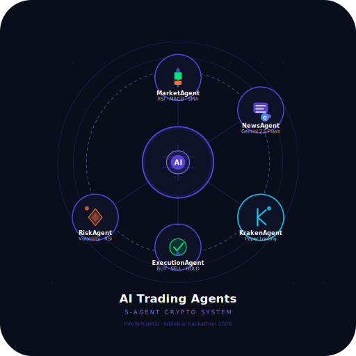

# 🚀 Autonomous AI Trading Agent

> This is not a trading dashboard.
> It is an autonomous multi-agent AI trading system.

---
<p align="center">
  
</p>

---

## 🧠 Overview

AI Trading Agent is a **real-time autonomous system** that analyzes market data, interprets news sentiment, evaluates risk, and executes trading decisions.

The system is designed as a **multi-agent architecture**, where each agent has a specialized role in the trading pipeline.

---

## ⚡ Key Features

* 📊 Market analysis (trend, volatility, indicators)
* 📰 News sentiment analysis using AI
* ⚖️ Risk management (position sizing, exposure control)
* 🤖 AI-powered insights using Google Gemini
* 🧠 Decision engine (BUY / SELL / HOLD)
* 🔁 Trade execution simulation (Kraken-compatible)
* 📉 Portfolio tracking (PnL, drawdown)
* 🎨 Interactive dashboard (Streamlit)

---

## 🏗 Architecture

The system follows a **multi-agent pipeline**:

```
Market Agent → News Agent → Risk Agent → Trading Brain → Execution Agent
```

### Agents

* **Market Agent**

  * Analyzes price, trend, and technical indicators

* **News Agent**

  * Extracts sentiment from live news (Gemini-powered)

* **Risk Agent**

  * Calculates risk, position sizing, and exposure

* **Trading Brain (Orchestrator)**

  * Combines all signals and makes final decision

* **Execution Agent**

  * Simulates trade execution (Kraken-compatible logic)

---

## 🤖 AI Integration

Google Gemini is used for:

* Market interpretation
* News sentiment understanding
* Explanation of trading decisions

Fallback logic ensures the system works even without AI.

---

## 🛠 Tech Stack

* **Backend:** FastAPI
* **Frontend:** Streamlit
* **AI:** Google Gemini API
* **Data:** yfinance, RSS feeds
* **Visualization:** Plotly
* **Language:** Python

---

## 🎬 Demo Video

👉 https://www.youtube.com/watch?v=IGJ9_waZwG8

---

## 📦 Installation

### 1. Clone the repository

```bash
git clone https://github.com/YOUR_USERNAME/ai-trading-agents.git
cd ai-trading-agents
```

---

### 2. Create virtual environment

```bash
python -m venv .venv
.venv\Scripts\activate
```

---

### 3. Install dependencies

```bash
pip install -r requirements.txt
```

---

## 🔑 Environment Setup

Create `backend/.env` file:

```env
GOOGLE_API_KEY=your_api_key
ENABLE_LLM_EXPLANATIONS=true
GEMINI_MODEL=gemini-2.5-flash

ALLOWED_ORIGINS=["http://localhost:8501","http://127.0.0.1:8501"]

REQUEST_TIMEOUT_SECONDS=12
NEWS_MAX_ARTICLES=8

KRAKEN_MODE=paper
ENABLE_EXECUTION=true

DEFAULT_SYMBOL=BTCUSD
DEFAULT_USD_SIZE=10
EXECUTION_CASH_FRACTION=0.10
```

---

## ▶️ Run the Application

### Start backend

```bash
cd backend
uvicorn app.main:app --reload
```

---

### Start frontend

```bash
streamlit run frontend/streamlit_app.py
```

---

## 🌐 Access

* Frontend: http://localhost:8501
* Backend: http://127.0.0.1:8000
* Health: http://127.0.0.1:8000/health

---

## 📊 Output

The system provides:

* BUY / SELL / HOLD signal
* Confidence score
* AI-generated explanation
* News sentiment
* Risk analysis
* Portfolio metrics

---

## ⚠️ Disclaimer

This project is for research and demonstration purposes only.
It does not provide financial advice or real trading guarantees.

---

## 🚀 Why This Project Stands Out

* True **multi-agent architecture**
* Combines **market + news + risk + AI**
* Designed as an **autonomous decision-making system**
* Ready for integration with real trading systems (Kraken-compatible)

---

## 👨‍💻 Author

**Azamat Madrimov**

---

## 🔮 Future Improvements

* Real-time execution with exchanges
* Advanced AI trading strategies
* Multi-asset support
* Cloud deployment
* AI chat assistant

---

## 🏁 Final Note

This project demonstrates how autonomous AI agents can transform trading from manual decision-making into intelligent, data-driven automation.
